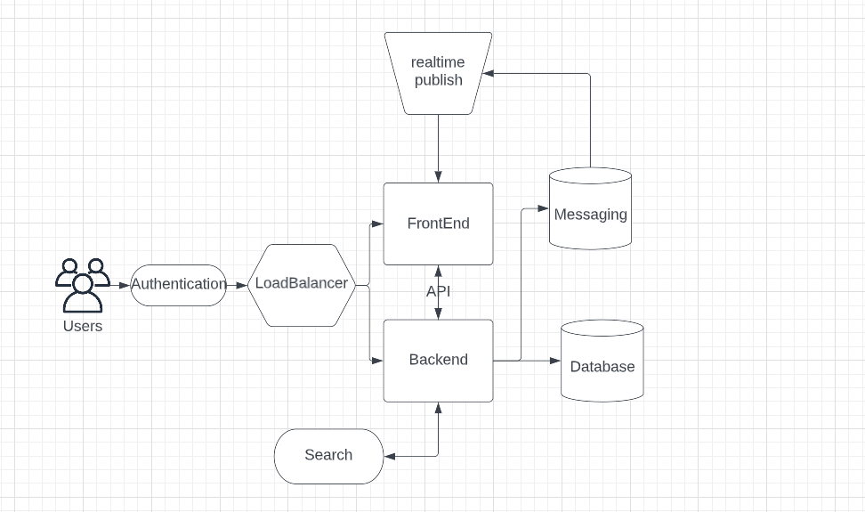
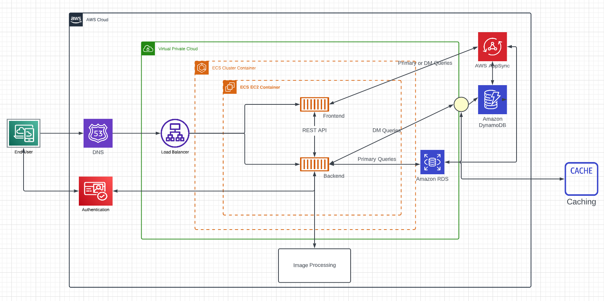

# Week 0 — Billing and Architecture

I learnt about different frameworks for architecting including TOGAF and C4.

I also learnt about the Iron triangle and why it is important to ask the 'dumb' questions.

I installed the AWS CLI.

I created a conceptual diagram for the Cruddur app. Link below.
https://lucid.app/lucidchart/eb48b801-b071-48ed-8b74-be1d124d71cd/edit?invitationId=inv_a8f1d634-80f7-489c-8862-3021437af835&page=0_0#

I also recreated the logical diagram for the Cruddur app. Link is below.
https://lucid.app/lucidchart/04724b01-5658-49ca-8f28-047d369f654a/edit?viewport_loc=-596%2C-487%2C1174%2C1326%2C0_0&invitationId=inv_136406be-9497-4acb-996e-5e527da4c393

