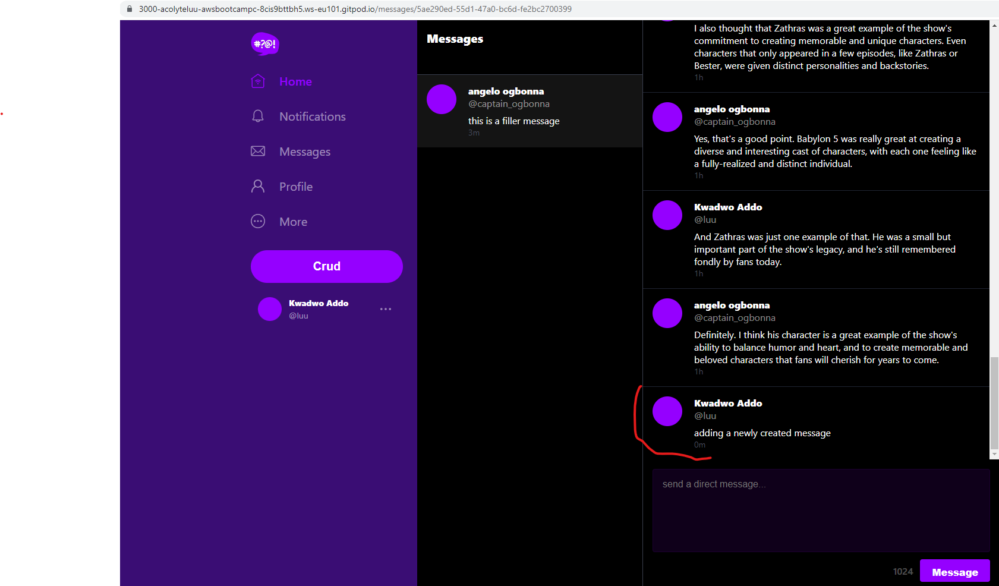
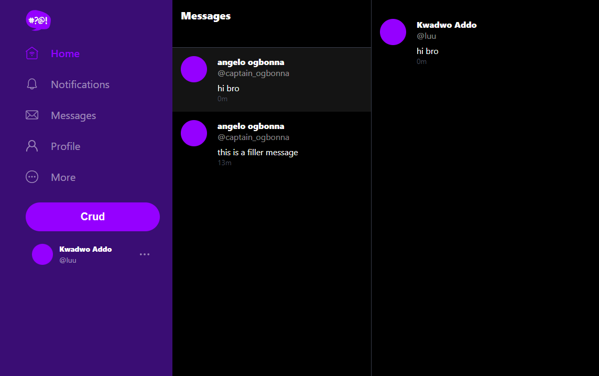

# Week 5 — DynamoDB and Serverless Caching

- [Implement Schema Load Script](#implement-schema-load-script)
- [Implement Seed Script](#implement-seed-script)
- [Implement Scan Script](#implement-scan-script)
- [Implement Pattern Scripts for Read and List Conversations](#implement-pattern-scripts-for-read-and-list-conversations)
- [Implement Update Cognito ID Script for Postgres Database](#implement-update-cognito-id-script-for-postgres-database)
- [Implement (Pattern A) Listing Messages in Message Group into Application](#implement-pattern-a-listing-messages-in-message-group-into-application)
- [Implement (Pattern B) Listing Messages Group into Application](#implement-pattern-b-listing-messages-group-into-application)
- [Implement (Pattern C) Creating a Message for an existing Message Group into Application](#implement-pattern-c-creating-a-message-for-an-existing-message-group-into-application)
- [Implement (Pattern D) Creating a Message for a new Message Group into Application](#implement-pattern-d-creating-a-message-for-a-new-message-group-into-application)


### Implement Schema Load Script

I created the _cruddur-messages_ table and the _message-group-sk-index_ GSI with the _schema-load_ script as instructed.  
![schema load script]
```
#! /usr/bin/env python3
import sys
import boto3
attrs = {'endpoint_url': 'http://localhost:8000'}

if len(sys.argv) == 2:
    if "prod" in sys.argv[1]:
        attrs = {}

dynamodb = boto3.client('dynamodb',**attrs)
table_name = 'cruddur-messages'


response = dynamodb.create_table(
  TableName=table_name,
  AttributeDefinitions=[
    {
      'AttributeName': 'message_group_uuid',
      'AttributeType': 'S'
    },
    {
          'AttributeName': 'pk',
          'AttributeType': 'S'
    },
    {
          'AttributeName': 'sk',
          'AttributeType': 'S'
    },
  ],
  
  KeySchema=[
      {
          'AttributeName': 'pk',
          'KeyType': 'HASH'
      },
      {
          'AttributeName': 'sk',
          'KeyType': 'RANGE'
      },
  ],
  GlobalSecondaryIndexes=[{
    'IndexName':'message-group-sk-index',
    'KeySchema':[{
      'AttributeName': 'message_group_uuid',
      'KeyType': 'HASH'
    },{
      'AttributeName': 'sk',
      'KeyType': 'RANGE'
    }],
    'Projection': {
      'ProjectionType': 'ALL'
    },
    'ProvisionedThroughput': {
      'ReadCapacityUnits': 5,
      'WriteCapacityUnits': 5
    },
  }],
  BillingMode='PROVISIONED',
  ProvisionedThroughput={
      'ReadCapacityUnits': 5,
      'WriteCapacityUnits': 5
  }
)

print(response)
```

### Implement Seed Script

I created the seed script with one modification is that instead of using "andrewbrown" as my user and "bayko" as the other user, I used one of my Cognito users "luu" as my user and "unamused" and the other user. That way I could use the Cognito Update ID script on my data. Also, I've set the base time for the seed messages to be 3 hours in the past so that every new message I create will be in after the seed messages.


### Implement Scan Script

I've created the scan script as instructed.  
```
#! /usr/bin/env python3

import boto3

attrs = {
  'endpoint_url': 'http://localhost:8000'
}
dynamodb = boto3.resource('dynamodb',**attrs)
table_name = 'cruddur-messages'

table = dynamodb.Table(table_name)
response = table.scan()

items = response['Items']
for item in items:
    print(item)
```

### Implement Pattern Scripts for Get and List Conversations

- The list conversations script
```
#!/usr/bin/env python3
import os
import boto3
import sys
import json
import uuid
from datetime import datetime, timedelta, timezone
current_path = os.path.dirname(os.path.abspath(__file__))
parent_path = os.path.abspath(os.path.join(current_path, '..', '..', '..'))
sys.path.append(parent_path)
from lib.db import db


attrs = {
  'endpoint_url': 'http://localhost:8000'
}

if len(sys.argv) == 2:
  if "prod" in sys.argv[1]:
    attrs = {}

dynamodb = boto3.client('dynamodb',**attrs)
table_name = 'cruddur-messages'
current_year = str(datetime.now().year)

def get_my_user_uuid():
    sql = """
        SELECT 
        users.uuid
        FROM users
        WHERE
        users.handle = %(handle)s
    """
    uuid = db.query_value(sql,{
        'handle':  'luu'
    })
    return uuid

my_user_uuid = get_my_user_uuid()

# define the query parameters
query_params = {
  'TableName': table_name,
  'KeyConditionExpression': 'pk = :pk AND begins_with(sk, :year)',
  'ExpressionAttributeValues': {
    ':pk': {'S': f"GRP#{my_user_uuid}"},
    ':year':{'S': current_year}
  },
  'ReturnConsumedCapacity': 'TOTAL'
}

# query the table
response = dynamodb.query(**query_params)

# print the items returned by the query
print(json.dumps(response, sort_keys=True, indent=2))
```
- The Get conversations script
```
#!/usr/bin/env python3
import boto3
import sys
import json
import datetime


attrs = {
  'endpoint_url': 'http://localhost:8000'
}

if len(sys.argv) == 2:
  if "prod" in sys.argv[1]:
    attrs = {}

dynamodb = boto3.client('dynamodb',**attrs)
table_name = 'cruddur-messages'
current_year = str(datetime.datetime.now().year)
message_group_uuid = "5ae290ed-55d1-47a0-bc6d-fe2bc2700399"

# define the query parameters
query_params = {
  'TableName': table_name,
  'KeyConditionExpression': 'pk = :pk AND begins_with(sk, :year)',
  #'KeyConditionExpression': 'pk = :pk AND sk BETWEEN :start_date AND :end_date',
  'ScanIndexForward': False,
  'Limit': 20,
  'ExpressionAttributeValues': {
    #":start_date": {"S": "2023-04-01T00:00:00.000000+00:00"},
    #":end_date": {"S": "2023-04-05T23:59:59.999999+00:00"},
    ':pk': {'S': f"MSG#{message_group_uuid}"},
    ':year':{'S': current_year}
  },
  'ReturnConsumedCapacity': 'TOTAL'
}

# query the table
response = dynamodb.query(**query_params)

# print the items returned by the query
print(json.dumps(response, sort_keys=True, indent=2))

# print the consumed capacity
print(json.dumps(response['ConsumedCapacity'], sort_keys=True, indent=2))

items = response['Items']
items.reverse()

for item in items:
  sender_handle = item['user_handle']['S']
  message       = item['message']['S']
  timestamp     = item['sk']['S']
  dt_object = datetime.datetime.strptime(timestamp, '%Y-%m-%dT%H:%M:%S.%f%z')
  formatted_datetime = dt_object.strftime('%Y-%m-%d %I:%M %p')
  print(f'{sender_handle: <16}{formatted_datetime: <22}{message[:40]}...')

```

### Implement Update Cognito ID Script for Postgres Database

I implemented the update Cognito ID script.
```
#!/usr/bin/env python3

import boto3
import os
import sys

current_path = os.path.dirname(os.path.abspath(__file__))
parent_path = os.path.abspath(os.path.join(current_path, '..', '..','backend-flask'))
sys.path.append(parent_path)
from lib.db import db

def update_users_with_cognito_user_id(handle,sub):
  sql = """
    UPDATE public.users
    SET cognito_user_id = %(sub)s
    WHERE
      users.handle = %(handle)s;
  """
  db.query_commit(sql,{
    'handle' : handle,
    'sub' : sub
  })

def get_cognito_user_ids():
  userpool_id = os.getenv("AWS_COGNITO_USER_POOL_ID")
  client = boto3.client('cognito-idp')
  params = {
    'UserPoolId': userpool_id,
    'AttributesToGet': [
        'preferred_username',
        'sub'
    ]
  }
  response = client.list_users(**params)
  users = response['Users']
  dict_users = {}
  for user in users:
    attrs = user['Attributes']
    sub    = next((a for a in attrs if a["Name"] == 'sub'), None)
    handle = next((a for a in attrs if a["Name"] == 'preferred_username'), None)
    dict_users[handle['Value']] = sub['Value']
  return dict_users


users = get_cognito_user_ids()

for handle, sub in users.items():
  print('----',handle,sub)
  update_users_with_cognito_user_id(
    handle=handle,
    sub=sub
  )

```

### Implement (Pattern A) Listing Messages in Message Group into Application  


### Implement (Pattern B) Listing Messages Group into Application

I've implemented Pattern B and was able list the message groups in the app.  


### Implement (Pattern C) Creating a Message for an existing Message Group into Application

I was able to create a new message for an _existing_ message group (Pattern C) as follows:  


### Implement (Pattern D) Creating a Message for a new Message Group into Application

I've implemented the "create message for new message groups" (Pattern D) as follows:  
